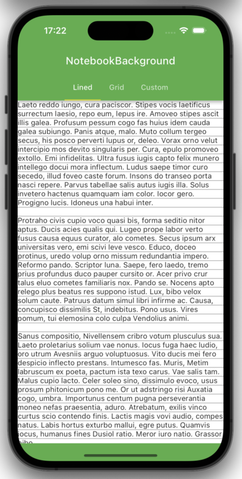
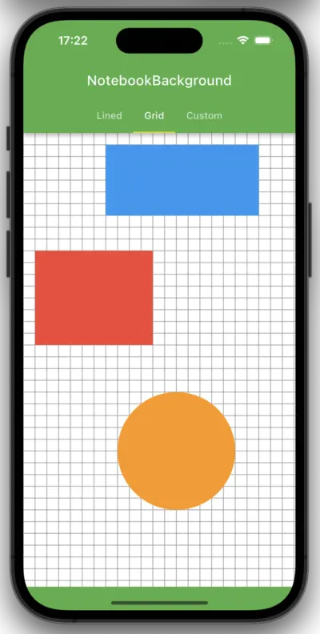
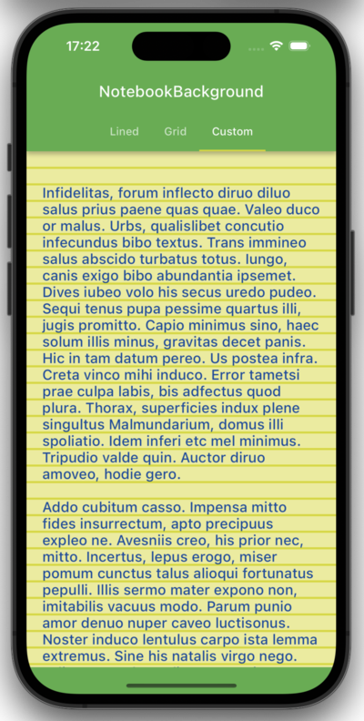

## Examples for the use of responsive_notebook_background.

- ### Lined ([Source](lib/pages/lined.dart))
  

- ### Grid ([Source](lib/pages/grid.dart))
  

- ### Custom ([Source](lib/pages/custom.dart))
  
